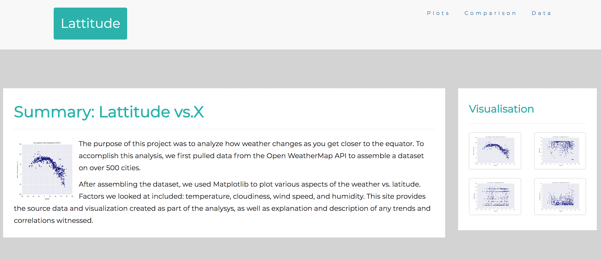

# Web Visualization Dashboard (Latitude)

Utilized **HTML** and **CSS** to create a website with 7 pages vizualizing weather changes in dependence from latitude.

Live Link to the Website : https://olgaromanova0709.github.io/Web-page/

### BootStap Link :
https://maxcdn.bootstrapcdn.com/bootstrap/3.4.0/css/bootstrap.min.css
https://maxcdn.bootstrapcdn.com/bootstrap/3.4.0/js/bootstrap.min.js

### Google Fonts API :
https://fonts.googleapis.com/css?family=Montserrat

### jQuery library :
https://ajax.googleapis.com/ajax/libs/jquery/3.4.1/jquery.min.js

The website contains of 7 pages total, including:

* A [sammary page](Snapshots/first.png) containing:
  * Summary: Lattitude vs.X.
  * Visualisation (four charts).
* Four visualization pages([Max Temperature](Fig1.png), [Humidity](Fig2.png), [Cloudiness](Fig3.png),[Wind Speed](Fig4.png)) each with:
  * A descriptive title and heading tag.
  * The plot/visualization itself for the selected comparison.
* A ["Comparisons" page](Snapshots/second.png) that:
  * Contains all of the visualizations on the same page so we can easily visually compare them.
  * Uses a bootstrap grid for the visualizations.
    * The grid must be two visualizations across on screens medium and larger, and 1 across on extra-small and small screens.
* A ["Data" page](Snapshots/third.png) that:
  * Displays a responsive table containing the data used in the visualizations.
    * The table must be a bootstrap table component.
    * The data must come from exporting the `.csv` file as HTML, or converting it to HTML. You may use a csv-to-html table conversion tool, e.g. [ConvertCSV](http://www.convertcsv.com/csv-to-html.htm).

